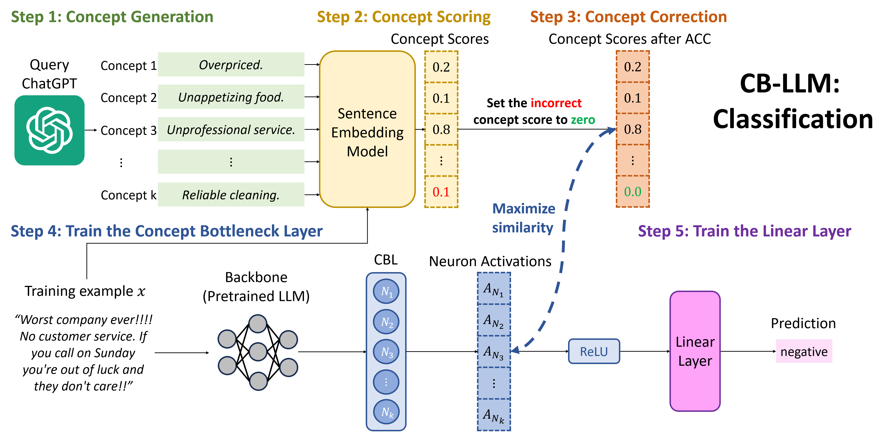
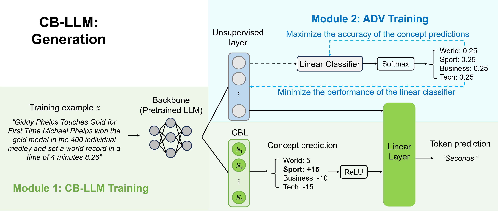
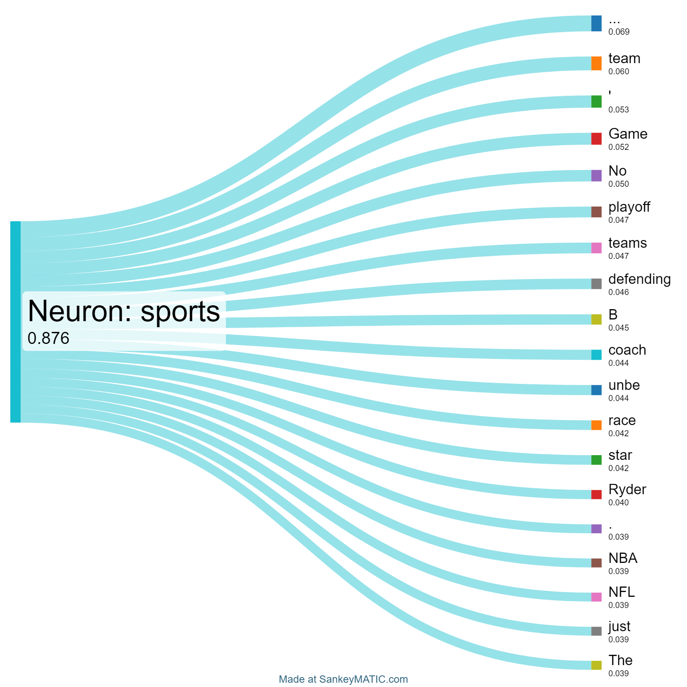

# Opening the Bottleneck: Steering LLMs via Concept Intervention

**Neil Dandekar & Christian Guerra** · UCSD DSC 180B Capstone · Advised by Lily Weng

> **Project Website:** [neil-dandekar.github.io/capstone-site](https://neil-dandekar.github.io/capstone-site/) &nbsp;|&nbsp; **Report:** [Q2Report_Checkpoint-3.pdf](./Q2Report_Checkpoint-3.pdf) &nbsp;|&nbsp; **Original Paper:** [CB-LLMs (ICLR 2025)](https://arxiv.org/abs/2412.07992)

---

## What We Built

This project reproduces and extends the [Concept Bottleneck Large Language Models (CB-LLMs)](https://arxiv.org/abs/2412.07992) framework. Our contributions on top of the original authors' work are:

1. **Multi-neuron intervention analysis** — we go beyond the original paper's single-neuron edits to study how suppressing or amplifying *groups* of concept neurons jointly affects model predictions.
2. **Interactive Concept Manipulation GUI** — a Python-based interface where users can load a CB-LLM checkpoint, view concept activations for any input text, and adjust neuron values via sliders to observe real-time prediction changes.
3. **Reproduced benchmarks** — we replicate Tables 2 and 5 from the original paper across four datasets (SST2, YelpP, AG News, DBpedia), using the authors' finetuned checkpoints from HuggingFace.
4. **Sankey visualizations** — concept contribution diagrams showing how learned concept weights flow toward downstream predictions.

---

## CB-LLM: Classification

<p align="center">
  
</p>

The classification pipeline transforms a pretrained language model into an interpretable CB-LLM by inserting a **Concept Bottleneck Layer (CBL)** between the encoder and the prediction head. Each neuron in the CBL represents a human-interpretable concept (e.g., sentiment, topic, formality), and a sparse linear classifier uses these concept activations to make the final prediction.

---

## CB-LLM: Generation

<p align="center">
  
</p>

The generation pipeline extends CB-LLMs to autoregressive text generation using Llama3 with LoRA finetuning. Concept neurons can be steered at inference time to guide the style and content of generated text without retraining.

---

## Our Interactive GUI

<p align="center">
  
</p>

We built an interactive concept manipulation interface that:
- Loads a trained CB-LLM checkpoint
- Displays concept activations for any user-provided input sentence
- Lets users adjust individual neuron values via sliders
- Updates prediction probabilities in real time — no retraining required

The GUI is implemented in Python and connects slider-based controls to the model's internal concept layer via PyTorch forward hooks.

---

## Multi-Neuron Intervention

<p align="center">
  
</p>

A key extension beyond the original CB-LLM paper is our **multi-neuron intervention** setup. Rather than modifying one concept at a time, we apply a diagonal scaling matrix to suppress or amplify multiple neurons simultaneously:

$$A' = D_\alpha A$$

This lets us study how groups of concepts interact and jointly influence predictions — revealing effects that single-neuron edits miss.

---

## Concept Contribution Visualization

<p align="center">
  
</p>

We use Sankey diagrams to visualize how concept weights flow from individual neurons toward downstream class predictions. For AG News, one neuron consistently exhibited strong influence toward the Sports category, suggesting the bottleneck captures interpretable semantic structure rather than arbitrary features.

<p align="center">
  
</p>

---

## Repository Structure

```
capstone/
├── backend_api/          # API layer connecting the GUI to the CB-LLM model
├── classification/       # CB-LLM classification pipeline (from original authors, extended)
├── generation/           # CB-LLM generation pipeline (from original authors)
├── codex/                # Experiment scripts and analysis notebooks
├── frontend/             # Interactive GUI for concept manipulation
├── fig/                  # Figures used in the report and README
├── checkpoint.ipynb      # Self-contained Q1 reproduction notebook (no setup needed)
└── README.md
```

---

## Quickstart

### Reproduce Our Q1 Results (No Setup Required)

Open and run `checkpoint.ipynb` — it installs all dependencies automatically and reproduces the key tables from the paper.

### Run the Full Pipeline

**Requirements:** CUDA 12.1, Python 3.10, PyTorch 2.2

**Classification:**
```bash
cd classification
pip install -r requirements.txt

# Download finetuned checkpoints (skips training)
git lfs install
git clone https://huggingface.co/cesun/cbllm-classification temp_repo
mv temp_repo/mpnet_acs .
rm -rf temp_repo
```

**Generation:**
```bash
cd generation
pip install -r requirements.txt

git lfs install
git clone https://huggingface.co/cesun/cbllm-generation temp_repo
mv temp_repo/from_pretained_llama3_lora_cbm .
rm -rf temp_repo
```

### Run the GUI

```bash
cd frontend
pip install -r requirements.txt
python app.py
```

---

## Key Results

### Classification Accuracy (reproduced)

| Method | SST2 | YelpP | AGNews | DBpedia |
|---|---|---|---|---|
| CB-LLM (ours, w/ ADV training) | 0.9638 | 0.9855 | 0.9439 | 0.9924 |
| CB-LLM w/o ADV training | 0.9676 | 0.9830 | 0.9418 | 0.9934 |
| Llama3 finetuned (black-box) | 0.9692 | 0.9851 | 0.9493 | 0.9919 |

### Steerability (CB-LLM with ADV training vs. black-box)

| Dataset | CB-LLM (ours) | CB-LLM w/o ADV | Llama3 (black-box) |
|---|---|---|---|
| SST2 | **0.82** | 0.57 | ✗ |
| YelpP | **0.95** | 0.69 | ✗ |
| AGNews | **0.85** | 0.52 | ✗ |
| DBpedia | **0.76** | 0.21 | ✗ |

### Sports Neuron Intervention (AG News)

| Condition | Accuracy on Sports | Mean p(Sports) |
|---|---|---|
| No intervention | 0.94 | 0.89 |
| Sports neuron → 0 | 0.61 | 0.48 |
| Sports neuron × 2 | 0.97 | 0.94 |

---

## Contribution

| Person | Role |
|---|---|
| **Neil Dandekar** | Backend experimentation, CB-LLM reproduction, intervention logic, model evaluation |
| **Christian Guerra** | Frontend/GUI development, Sankey visualizations, project website deployment |
| **Lily Weng** | Research advising, methodology guidance, project direction |

---

## Citation

This project builds on:

```bibtex
@article{cbllm,
   title={Concept Bottleneck Large Language Models},
   author={Sun, Chung-En and Oikarinen, Tuomas and Ustun, Berk and Weng, Tsui-Wei},
   journal={ICLR},
   year={2025}
}
```

Original authors' repository: [Trustworthy-ML-Lab/CB-LLMs](https://github.com/Trustworthy-ML-Lab/CB-LLMs)
